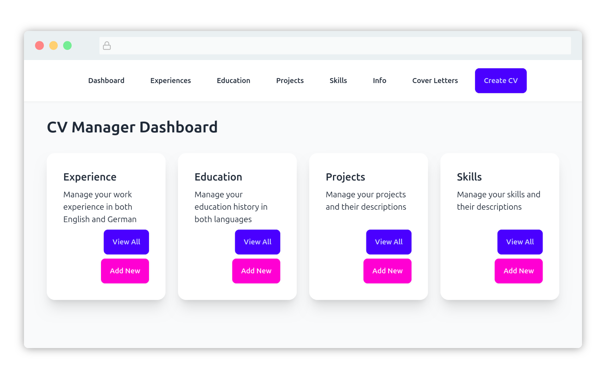

# CvCvCv

A run-it-locally Django app to manage CVs.
Manages data like job experience, education cover letters and personal info, and based on that quickly generates relevant CVs.

## App

*The app is pretty usable for now — at least for me, it does all the stuff I need for various cv/job application needs, and spits out decent PDFs. I froze development for now, probably until my next job search.* 

## Tech

- my standard AI-fed "local Django CMS" approach

## Structure

- `cvcvcv` is the default app that does essentially nothing
- `cv` is where the actual magic happens, and has a classic Django folders+files structure.

- We are loading Tailwind and Daisy via CDN, because this is personal, locally-run software anyways
- Happily using `sqlite` for the same reason

## Features

- mostly 1 feature per header item, then all are used when generating a cv

## Running It

- make a `venv`
- `pip install -r requirements`
- (you may wanna run `python manage.py migrate`)
- `python manage.py runserver`